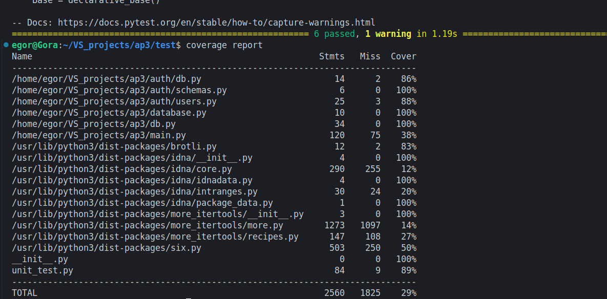

# README

## Описание API

1. **POST /links/shorten**  
   Создает короткую ссылку. Параметры: `original_url`, `custom_alias` (опционально), `expires_at` (опционально).  
   Ответ: короткая ссылка.

2. **GET /links/{short_code}**  
   Получение оригинальной ссылки по короткому коду. Возвращает оригинальную ссылку, если она существует.

3. **PUT /links/{short_code}**  
   Обновляет оригинальную ссылку для существующего короткого кода. Параметры: новый `original_url`.

4. **DELETE /links/{short_code}**  
   Удаляет короткую ссылку по коду. Только для авторизованных пользователей.

5. **GET /links/search**  
   Поиск короткой ссылки по оригинальной ссылке. Возвращает короткий код, если ссылка существует.

## Примеры запросов

### 1. Создание короткой ссылки:
```bash
POST /links/shorten
curl -X POST \                                                                                                                                   
  http://localhost:8000/links/shorten \
  -H "Content-Type: application/json" \
  -H "Authorization: Bearer <Token>" \
  -d '{                                       
    "original_url": "https://www.example.com",
    "custom_alias": "myalias"
  }'

```

## Описание БД
Используется база данных Postgres с таблицами Link и users для хранения коротких ссылок и информации о зарегестрированных пользователях. 

__link:__
* short_code: короткий код ссылки.
* original_url: оригинальная ссылка.
* expires_at: время истечения срока действия.
* visit_count: количество переходов по ссылке.
* last_used_at: дата последнего использования.
* user_id: идентификатор пользователя (если ссылка создана авторизованным пользователем).

__users:__

* id: Уникальный идентификатор
* email: Электронная почта
* hashed_password: Хеш пароля
* is_active: Статус активности
* is_superuser: Суперпользователь,
* is_verified: Верификация пользователя


## Запуск
```
docker-compose up --build
```


## Блок тестирования

* Создание короткой ссылки: Тестирует, что при правильных данных API возвращает правильную короткую ссылку.

* Генерация короткого кода: Проверяет, что генерация кода работает с дефолтной длиной (6 символов), кастомной длиной и создает уникальные коды.

* Обновление короткой ссылки без авторизации: Проверяет, что без авторизации возвращается ошибка 401.

* Удаление короткой ссылки без авторизации: Проверяет, что без авторизации возвращается ошибка 401.

* Мокирование сессий и Redis: Использует фикстуры для мока базы данных и Redis, чтобы тесты не зависели от реальных сервисов.


